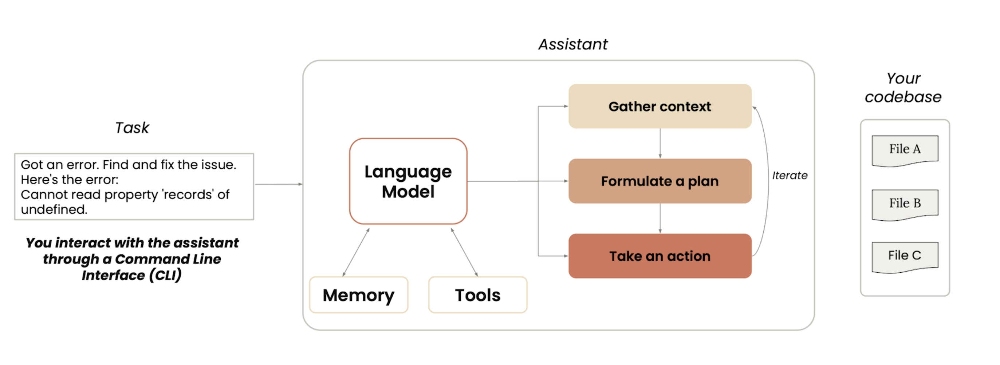

# Claude Code: A Highly Agentic Coding Assistant (DeepLearning.ai)

- Link: [Claude Code: A Highly Agentic Coding Assistant](https://www.deeplearning.ai/short-courses/claude-code-a-highly-agentic-coding-assistant/)

## Notes

### Overview
- Claude Code is an agentic coding assistant that doesn't index the codebase—it uses memory and conversation history instead.
    
- Claude Code (or any coding assistant) is only as good as the context you provide it.

### Memory & CLAUDE.md
- Claude Code uses CLAUDE.md files to remember preferences across sessions (project context, conventions, instructions).
- Docs: https://code.claude.com/docs/en/memory
- File locations:
    - `~/.claude/CLAUDE.md` - Applies to all Claude sessions
    - `./.claude/CLAUDE.md` - Check into git to share with your team
    - `./CLAUDE.local.md` - Personal project-specific preferences (auto-added to .gitignore)
- Modular rules: All `.md` files in `.claude/rules/` are automatically loaded. Use `@path/to/import` syntax to import additional files.
- Settings: See `.claude/settings.local.json` for default project settings (especially auto-run commands).

### Skills
- Use `$ARGUMENTS` as a placeholder in skill markdown; it gets replaced with whatever follows the skill name when invoked.
- Positional args: Use `$0`, `$1`, etc. for multiple arguments.
- Control skill loading:

    | Frontmatter | You can invoke | Claude can invoke | When loaded into context |
    |-------------|----------------|-------------------|--------------------------|
    | (default) | Yes | Yes | Description always in context, full skill loads when invoked |
    | `disable-model-invocation: true` | Yes | No | Description not in context, full skill loads when you invoke |
    | `user-invocable: false` | No | Yes | Description always in context, full skill loads when invoked |

- Use `allowed-tools` field to control which tools Claude can use when a skill is active.
- Advanced features (dynamic context injection): [advanced patterns](https://code.claude.com/docs/en/skills#advanced-patterns)

### Plugins & Hooks
- **GitHub plugin**: Raise issues, get help, create PRs, and merge—all from Claude.
- **Hooks**: Shell commands executed at various lifecycle points (before/after tool execution, when subagent finishes, when claude finishes responding).

### Git Worktrees
- Git worktrees let you check out multiple branches into separate directories with isolated files but shared Git history.
- Workflow: Open Claude in each worktree to work on different features in parallel, then merge back to main.

### Resources
- [L7 Notes](https://github.com/https-deeplearning-ai/sc-claude-code-files/blob/main/reading_notes/L7_notes.md): Prompts for notebook improvements and sales dashboard generation. Nice example of specifying expected deliverables.

---

## Commands

### Keyboard Shortcuts
| Shortcut | Action |
|----------|--------|
| `Shift+Tab` | Plan Mode—Claude reads/explores code without modifying files. Good for exploring unfamiliar codebases, planning changes, or code review. |
| `Ctrl+O` | Toggle verbose mode to see Claude's reasoning process. |
| `ESC` | Interrupt Claude to redirect or correct it. |
| `ESC ESC` | Rewind the conversation to an earlier point in time. |
| `@` | Mention files to include their content in your request. |

### CLI Commands
| Command | Description |
|---------|-------------|
| `claude --resume` | Resume session from previous conversation state. |
| `claude mcp add <server-name> <command> [args...]` | Add an MCP server (e.g., `claude mcp add playwright npx @playwright/mcp@latest`) |
| `/init` | Scan codebase and create CLAUDE.md file in project directory. |
| `/clear` | Clear current conversation history. |
| `/compact` | Summarize current conversation history. |
| `/mcp` | Manage MCP connections & check available servers with their tools. |
| `/skills` | List available skills. |
| `/hook` | Manage hooks. |

### Git Worktree Commands
```bash
mkdir .trees
git worktree add .trees/ui_feature
git worktree add .trees/testing_feature
git worktree add .trees/quality_feature
git worktree list
```
Merge worktrees: `use the git merge command to merge in all the worktrees of the .trees folder into main and fix any conflicts if there are any`

### Skill Examples
```markdown
# /fix-issue 123
---
name: fix-issue
description: Fix a GitHub issue
---
Analyze and fix the GitHub issue: $ARGUMENTS.
```

```markdown
# /create-component Button src/components
---
name: create-component
description: Create a new React component
---
Create a new React component named $0 in the $1 directory.
```

**Note**: Phrases like "think", "think hard", "ultrathink" are interpreted as regular prompts and don't allocate thinking tokens.
